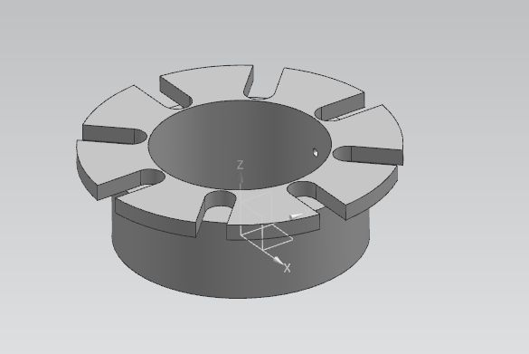
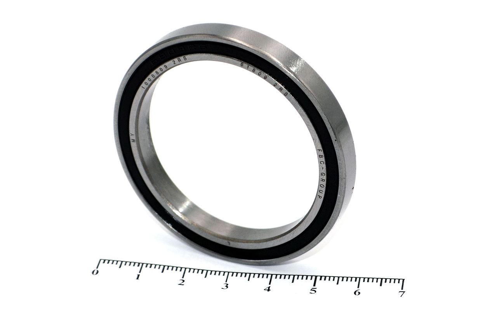
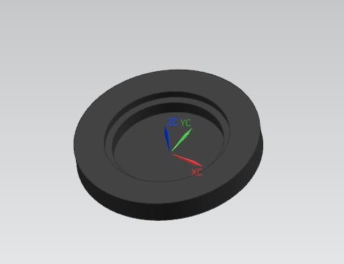

# Статус ringBox

| № | Деталь | 3D модель | Чертеж | Образец | Статус |
|---|--------|-----------|--------|---------|--------|
| 1 | Внешний корпус |  | нет  | нет  | Не готово |
| 2 | Внутренняя деталь |  | нет | нет  | Не готово |
| 3 | Поворотная часть для кольца | нет |  нет |  нет | Не готово |
| 4 | Подшипник | - | - |  | Готово |
| 5 | Дно |  | нет | нет | Не готово |
| 6 | Лепесток Х 8 | В процессе|  нет |  нет | Не готово |
| 7 | Направляющая |  нет |нет |  нет | Не готово |

## Сводка по статусам

- **Готово:**
- **В процессе:**
- **Не начинал:**

