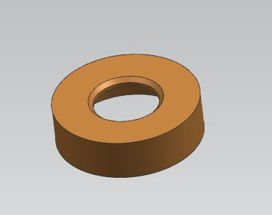

# Статус ringBox

| № | Деталь | 3D модель | Чертеж | Образец | Статус |
|---|--------|-----------|--------|---------|--------|
| 1 | Внешний корпус |  | $${\color{red}нет}$$ | $${\color{red}нет}$$  | $${\color{red}Не\ готово}$$ |
| 2 | Внутренняя деталь |  | $${\color{red}нет}$$ | $${\color{red}нет}$$  | $${\color{red}Не\ готово}$$ |
| 3 | Поворотная часть для кольца | $${\color{red}нет}$$ |  $${\color{red}нет}$$ |  $${\color{red}нет}$$ | $${\color{red}Не\ готово}$$ |
| 4 | Подшипник | - | - |  | $${\color{green}Готово}$$ |
| 5 | Дно |  | $${\color{red}нет}$$ | $${\color{red}нет}$$ | $${\color{red}Не\ готово}$$ |
| 6 | Лепесток Х 8 | $${\color{orange}В\ процессе}$$ |  $${\color{red}нет}$$ |  $${\color{red}нет}$$ | $${\color{red}Не\ готово}$$ |
| 7 | Направляющая |  $${\color{red}нет}$$ | $${\color{red}нет}$$ |  $${\color{red}нет}$$ | $${\color{red}Не\ готово}$$ |

## Сводка по статусам

- $${\color{green}Готово}$$
- $${\color{orange}В\ процессе}$$
- $${\color{red}Не\ начинал}$$

